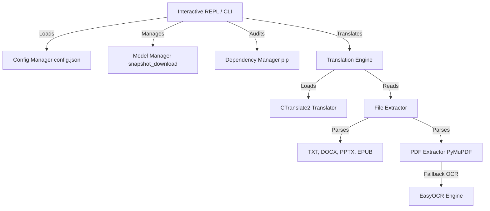

# 🐡 OpenBabelFish

[](https://opensource.org/licenses/MIT)
[](https://github.com/MdHussain121/OpenBabelFish)
[](https://github.com/willmcgugan/rich)
[](https://github.com/OpenNMT/CTranslate2)
[](https://huggingface.co/facebook/nllb-200-distilled-600M)

**OpenBabelFish** is a high-performance, fully-offline translation appliance powered by Meta's NLLB-200 (No Language Left Behind) models. It allows you to translate plain text and multi-format documents, perform OCR on scanned PDFs, and run interactive translations entirely locally on your CPU or GPU without compromising privacy.

---

## Table of Contents
1. [Key Features](#key-features)
2. [Component Architecture](#component-architecture)
3. [Inner Workings & Technical Details](#inner-workings--technical-details)
4. [JSON Config File Schema](#json-config-file-schema)
5. [Getting Started](#getting-started)
6. [Usage Guide](#usage-guide)
7. [Local Development & Testing](#local-development--testing)
8. [Troubleshooting & FAQ](#troubleshooting--faq)
9. [License](#license)

---

## Key Features

*   **100% Offline & Private**: Absolute offline execution. No telemetry or external API calls are made once models are downloaded.
*   **Diverse Document Extraction**: Directly extracts and translates text formatting from multiple file types:
    *   📄 **PDF (`.pdf`)**: Selectable text layer parsing, with automated fallback to OCR.
    *   📝 **Word (`.docx`)**: Sequencing of paragraph content.
    *   📊 **PowerPoint (`.pptx`)**: Text frame slide extractions.
    *   📚 **EPUB (`.epub`)**: HTML page parsing and extraction.
    *   🗂 **Plain Text (`.txt`)**: Clean text ingestion.
*   **Intelligent OCR Integration**: Integrated EasyOCR engine with automatic page-density heuristic detection. If the PDF lacks selectable text, it falls back to OCR automatically.
*   **Multilingual Flexibility**: Resolves standard language names (e.g. `spanish`), 2-letter ISO 639-1 language codes (e.g. `es`), and FLORES-200 codes (e.g. `spa_Latn`) seamlessly.
*   **Automated Model Management**: Instantly download, validate, and hot-swap local model variants (`600M`, `1.3B`, `3.3B`) directly from the CLI or REPL.
*   **On-Demand Dependency Auditing**: Audits missing system dependencies dynamically. If you try to open a PDF or run OCR without the required packages, it prompts and installs them with a real-time progress bar in MB.
*   **Terminal Optimization**: Built-in UTF-8 console reconfiguring preventing Unicode errors on Windows platforms.

---

## Component Architecture

OpenBabelFish separates command-line interfaces, configuration management, dependency auditing, and local neural translation engines:



### 1. Command-Line & REPL Interface (`openbabelfish/cli.py`)
*   Manages user argument parsing, direct translations, and interactive shell navigation.
*   Renders Rich UI structures, progress bars, model library statuses, and streaming displays.

### 2. Neural Translation Engine (`openbabelfish/engine.py`)
*   Maintains the `TranslationEngine` wrapping the CTranslate2 C++ inference runner and Hugging Face tokenizer.
*   Performs structural chunking (paragraphs and sentences) to align with NLLB-200's input constraints.

### 3. File Extractors (`openbabelfish/extractors.py`)
*   Maps and delegates file types to specialized document engines (PyMuPDF, python-docx, etc.).
*   Invokes EasyOCR fallbacks for image-based PDFs, supporting CPU/GPU execution.

---

## Inner Workings & Technical Details

### 1. Windows CUDA DLL Search Path Resolution
Due to Python 3.8+ Windows security modifications, custom directories containing C++ extension DLLs are not searched automatically unless explicitly registered. To load GPU-accelerated CTranslate2 libraries (`cublas64_12.dll`, `cudart64_12.dll`) without requiring local CUDA toolkit installations, OpenBabelFish handles loading as follows:

1.  It locates the virtual environment's site-packages `nvidia` subdirectories.
2.  It overrides the default DLL search behavior by invoking `SetDefaultDllDirectories(0x00001000)` via `ctypes` to make user-added directories discoverable by standard `LoadLibrary` calls.
3.  It adds directories using `os.add_dll_directory` and binds the returned cookie handle to `self._dll_cookies` to prevent Python's garbage collector from instantly removing the directory from the search path.

```python
import ctypes
import os

# Set search flags to include user directories
ctypes.windll.kernel32.SetDefaultDllDirectories(0x00001000)

# Keep the cookies alive to persist search paths
self._dll_cookies.append(os.add_dll_directory(cuda_bin_path))
```

### 2. Streaming (Beam=1) vs. Bulk Translation (Beam=2)
CTranslate2 does not support step-by-step token callbacks when performing beam search (`beam_size > 1`) because candidate paths are evaluated dynamically. OpenBabelFish optimizes for both speed and quality automatically:
*   **Streaming Mode (REPL/Interactive prompts)**: Configured with `stream=True` and `beam_size=1`. Translates in real-time with greedy decoding, yielding tokens immediately.
*   **Bulk Mode (Files/Pipes/Non-interactive)**: Configured with `stream=False` and `beam_size=2` (Beam Search). Offers high-quality, consistent translations (preventing numeric errors like translating `1` to Roman `I`).

---

## JSON Config File Schema

Configuration settings are stored locally in `config.json` inside the `.openbabelfish` home directory:

```json
{
    "model_variant": "600M",
    "device": "cpu",
    "quantization": "int8",
    "ocr_device": "cpu"
}
```

---

## Getting Started

### Prerequisites

Ensure you have the following installed on your machine:
*   [Python 3.10+](https://www.python.org/)
*   [Git](https://git-scm.com/)
*   (Optional) NVIDIA GPU with up-to-date drivers for CUDA acceleration.

### Quick Start (Windows)

A single-click batch script handles initialization:
*   **Double-click [run_openbabelfish.bat](file:///c:/Users/moham/Pictures/contributions/OpenBabelFish/run_openbabelfish.bat)**: This creates the isolated virtual environment (`venv`), installs all core dependencies, registers the package, verifies GPU libraries, and launches the interactive REPL.

### Manual Installation

1.  Clone the repository:
    ```bash
    git clone https://github.com/MdHussain121/OpenBabelFish.git
    cd OpenBabelFish
    ```

2.  Create and activate a virtual environment:
    ```bash
    python -m venv venv
    venv\Scripts\activate
    ```

3.  Install the package in editable mode:
    ```bash
    pip install -e .
    ```

---

## Usage Guide

### CLI Commands

Run direct translations or configuration commands from your terminal:

```bash
# Translate a plain text file to Spanish
openbabelfish --to es --file document.txt

# Save translation output to a specific file
openbabelfish --to french --file report.docx --output translated_report.docx

# Force OCR on a PDF and run it on your GPU
openbabelfish --to japanese --file scanned.pdf --ocr --ocr-device gpu

# Show installed and available translation models
openbabelfish --models

# Audit system dependencies and install missing ones
openbabelfish --packages
```

### Options Reference

*   `--to <lang>`: Target language (Accepts name, 2-letter ISO code, or FLORES code).
*   `--from <lang>`: Source language (Auto-detected if not specified).
*   `-f, --file <path>`: Ingest document for translation (`.txt`, `.pdf`, `.docx`, `.pptx`, `.epub`).
*   `-o, --output <path>`: Write translation results directly to a file.
*   `--gpu` / `--cpu`: Force specific hardware mode for translation.
*   `--ocr`: Force OCR extraction on PDF files.
*   `--ocr-device <cpu|gpu>`: Device mapping for EasyOCR engine.

### Interactive REPL Mode

Launch the interactive shell by running `openbabelfish` with no arguments:

```text
openbabelfish ❯ spanish: Hello world, this is a local translation.
  Hola mundo, esta es una traducción local.

openbabelfish ❯ file chapter1.docx to spanish
  [Runs translation for Word document...]

openbabelfish ❯ gpu
  ✓ Mode set to ⚡ CUDA (GPU) (Model: 600M)
```

---

## Local Development & Testing

### Run Test Suite
Run tests using pytest in your environment:
```bash
venv/Scripts/pytest
```

---

## Troubleshooting & FAQ

### Q1: RuntimeError: Library `cublas64_12.dll` is not found or cannot be loaded.
*   **Cause**: On Windows, the required NVIDIA CUDA runtimes are missing from your environment.
*   **Solution**: Run `openbabelfish --packages` in the console. When prompted, select to install GPU support. The application will automatically download and install the required `nvidia-cuda-*` packages into the virtual environment.

### Q2: EasyOCR download is extremely slow or fails during OCR fallback.
*   **Cause**: The default OCR model files are hosted on public storage repositories and might experience network timeouts.
*   **Solution**: Ensure you have an active network connection on first use. OpenBabelFish will attempt to pre-download detector models cleanly. Alternatively, you can place download files directly inside `~/.EasyOCR/model/`.

### Q3: Why does text look slightly different or less accurate when translated in the REPL compared to file outputs?
*   **Cause**: The REPL uses streaming output (which requires greedy decoding with `beam_size=1` for token callback compatibility). File translations use bulk mode (which runs beam search with `beam_size=2` for maximum contextual quality).
*   **Solution**: File-based translations and piped redirect inputs automatically utilize high-quality beam search to ensure numbers and complex vocabulary are translated accurately.

---

## License

Distributed under the MIT License. See `LICENSE` for more information.
